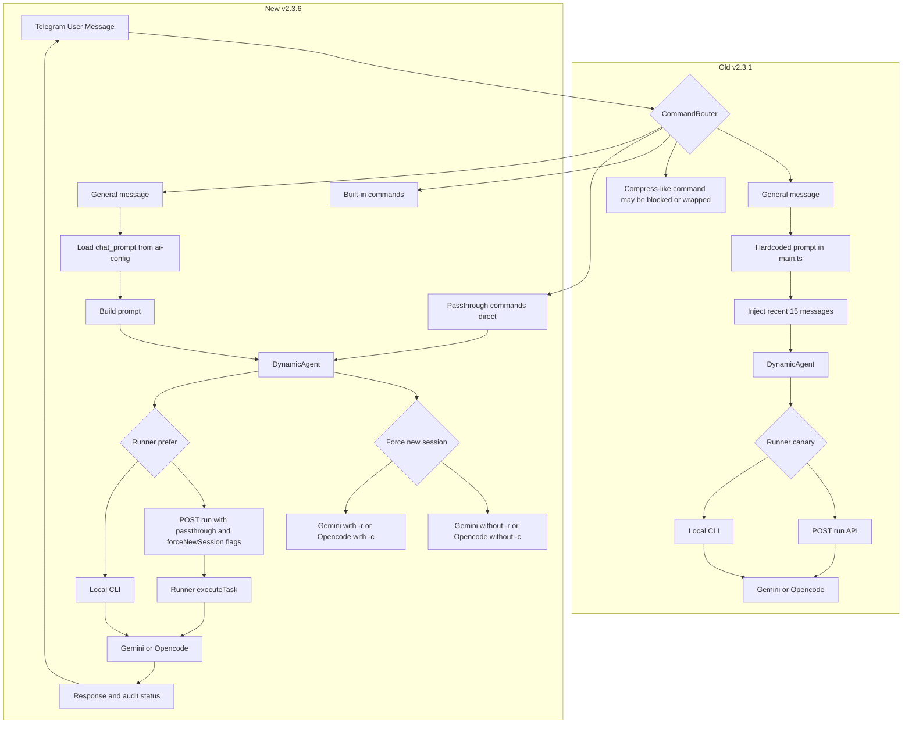

# TeleNexus 流程圖（舊版 vs 新版）

## 重點差異

- 舊版：一般對話會手動注入最近 15 則歷史。
- 新版：移除 15 則注入，改以 CLI session (`-r` / `-c`) 為主。
- 新版：`passthrough_commands` 直通 CLI，不包 TeleNexus 一般 prompt。
- 新版：新增 `/new`，可對「下一則一般對話訊息」強制開新 session。
- 新版：`chat_prompt` 可由 `ai-config.yaml` 外部化配置。
